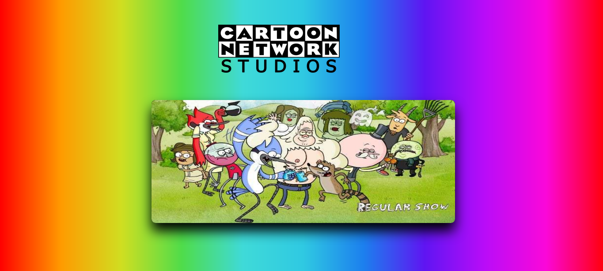

# Slideshow do Cartoon Network
### Descrição do projeto
Um slideshow com ações para retroceder e avanças. Utilizei no projeto alguns recursos do javascript, como por exemplo, funções do tipo arrow, template string, manipulação de elementos HTML no DOM. Sempre que possível criando um código limpo e semântico.

### Imagem do Projeto

## ✔️ Tecnologias utilizadas

- ``HTML``
- ``CSS``
- ``JavaScript``
